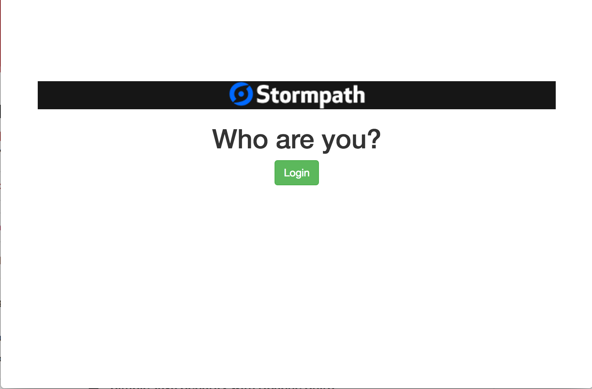
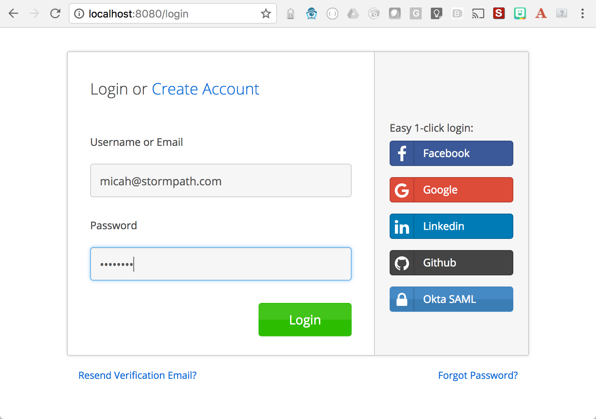
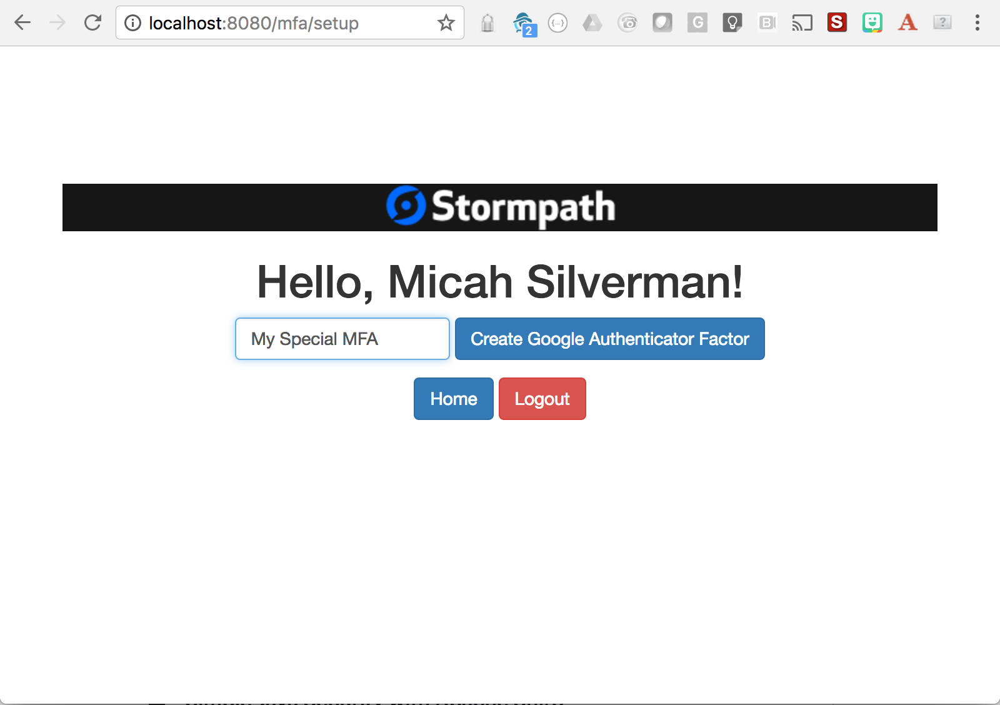
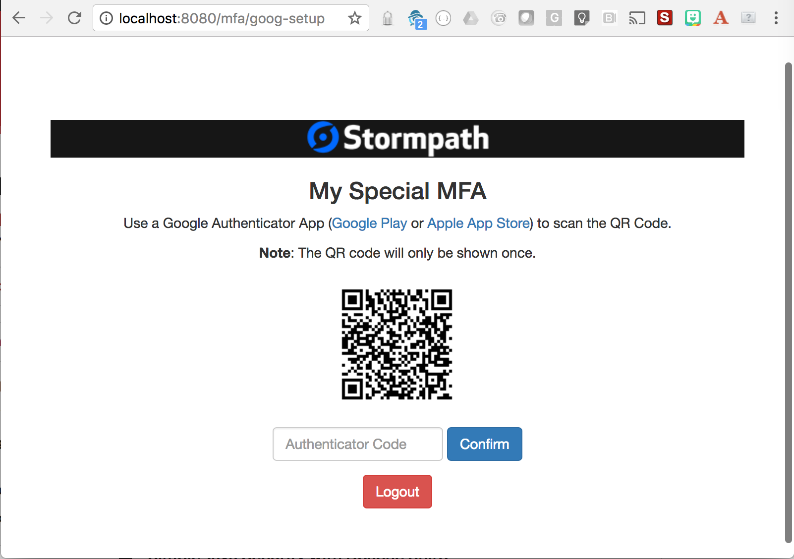
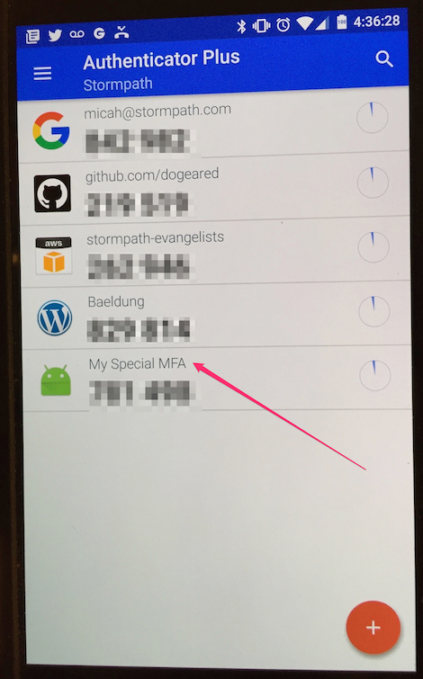
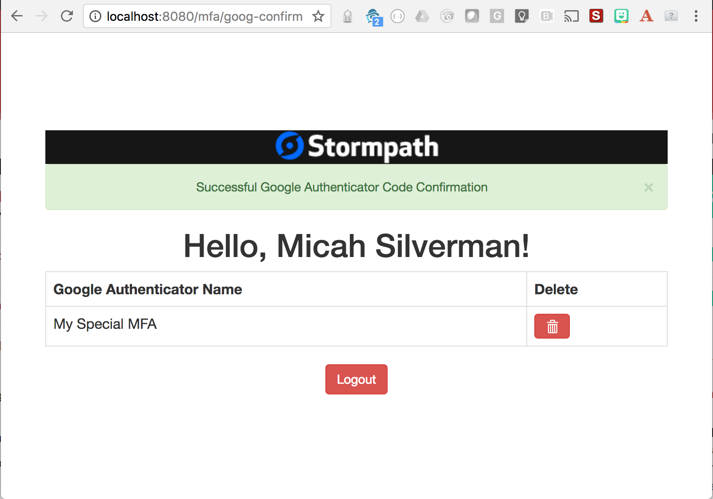
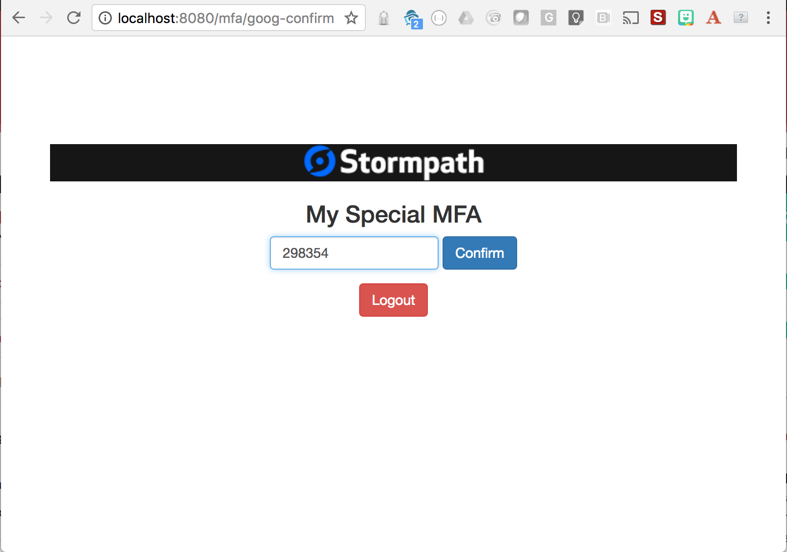

#Stormpath is Joining Okta

We are incredibly excited to announce that [Stormpath is joining forces with Okta](https://stormpath.com/blog/stormpaths-new-path?utm_source=github&utm_medium=readme&utm-campaign=okta-announcement). Please visit [the Migration FAQs](https://stormpath.com/oktaplusstormpath?utm_source=github&utm_medium=readme&utm-campaign=okta-announcement) for a detailed look at what this means for Stormpath users.

We're available to answer all questions at [support@stormpath.com](mailto:support@stormpath.com).

## Stormpath Spring Boot MFA Example

This example demonstrates a flow where an multi-factor authentication (MFA) confirmation is required after each login and before gaining access to protected pages.

In particular, it uses [TOTP](https://en.wikipedia.org/wiki/Time-based_One-time_Password_Algorithm) for MFA. And, it uses The [Google Authenticator](https://en.wikipedia.org/wiki/Google_Authenticator) [QR Code](https://en.wikipedia.org/wiki/QR_code) to set the shared secret. 
So, you'll want to grab a Google Authenticator compliant app for your smart phone.

TL;DR:

1. [Register](https://api.stormpath.com/register) for Stormpath
2. Save your apiKey file (Found by following the Manage API Keys link in the admin console) to: `~/.stormpath/apiKey.properties`
3. `mvn clean install`
4. `mvn spring-boot:run`
5.  Browse to: [http://localhost:8080](http://localhost:8080)

**Note:** Multi-Factor Authentication is only available with paid Stormpath plans. 
For more information please see [Stormpath’s Pricing Page](https://stormpath.com/pricing).

You can see this example in action at [https://stormpath-mfa-example.herokuapp.com](https://stormpath-mfa-example.herokuapp.com)

The flow looks like this:

The diagram above is not as complex as it may seem. You can think of the left and right sides as two different flows.

On the right side of the diagram, the user has not logged in yet.

On the left side of the diagram, the use has already logged in.

Both flows ensure that (a) the user sets up MFA and (b) the user has validated the latest token code after logging in, but before getting to an authenticated page.

This example takes advantage of Stormpath's [postLoginHandler](https://docs.stormpath.com/java/spring-boot-web/login.html#post-login-handler) that all of our integrations support.

Here's the typical flow:

1. Home Page - Unauthenticated

    

2. Login

    

3. Create Google Authenticator MFA

    

4. Verify MFA Code

    

    

5. Home Page - Authenticated

    

6. Logout

    

7. Login

    

8. Confirm Latest MFA code (No QR Code this time)

    

9. Home Page - Authenticated

    
